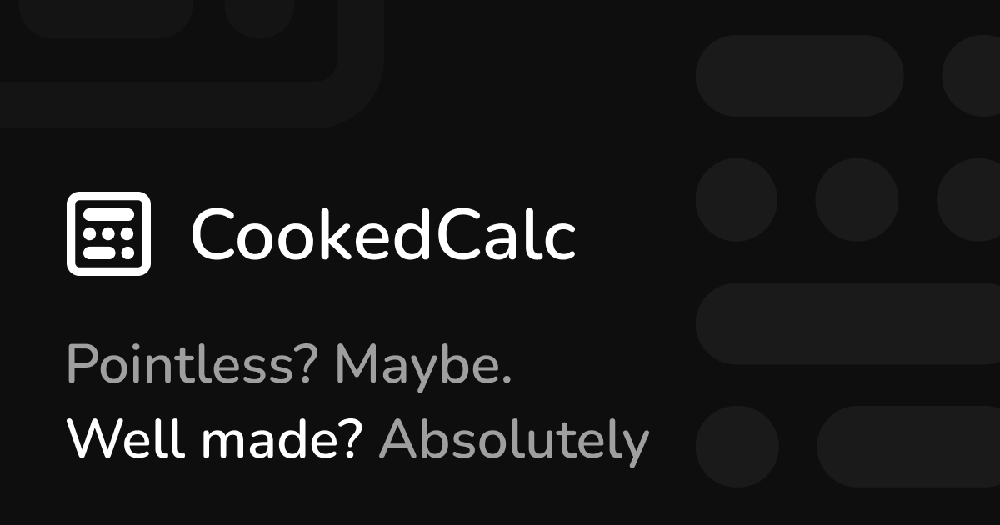

<p align="center">
  
</p>

<p align="center">
  <a href="https://cookedcalc.djalilmsk.dev">
    
  </a>
  
  
  
  <a href="https://github.com/djalilmsk/avg-calc/stargazers">
    
  </a>
</p>

<h3 align="center" >A semester-grade workspace that lets you manage multiple scenarios, save and reuse templates, and keep everything stored locally.</h3>

#

<h1 align="center"> Pointless? Maybe. Well made? Absolutely</h1>

 <p align="center">
  <a href="https://cookedcalc.djalilmsk.dev">
    https://cookedcalc.djalilmsk.dev
  </a>
</p>

## What This App Does

CookedCalc helps students compute weighted semester averages with a workflow built around reusable templates and separate history workspaces.

You can:

- Start from a built-in template or create a custom workspace
- Add modules with coefficient + Exam/TD setup
- Enter grades (0 to 20, step 0.25)
- Compare outcomes by duplicating histories
- Pin important histories in the sidebar
- Turn any history into a reusable template
- Use undo/redo and keyboard shortcuts for fast editing
- Customize theme, font, and UI roundness

## Core Workflow

1. Open Home and pick a template (or create a blank history from the add-module bar)
2. Enter module data (coefficient, TD, Exam, per-module weights)
3. Let CookedCalc compute per-module finals + global semester average
4. Save variants as separate histories or promote a history to a template

## Features

- Weighted semester average from module coefficients
- Per-module Exam/TD toggles and weights
- History management: rename, pin, duplicate, delete
- Template management: create from history, edit, delete
- Undo/redo timeline
- Mobile and desktop optimized layouts
- Built-in docs page (`/docs`)
- SEO metadata + structured data
- PWA manifest support (`vite-plugin-pwa`)

## Keyboard Shortcuts

- `Enter` (inside add-module inputs): submit module
- `Tab`: move between TD and Exam inputs
- `Alt + Enter`: next history
- `Alt + Shift + Enter`: previous history
- `Ctrl + M`: focus add-module input
- `Ctrl + Shift + O`: open home/new workspace
- `Ctrl + Shift + H`: open "create template" for current history
- `Ctrl + Shift + D`: duplicate current history
- `Ctrl + Shift + Backspace`: delete current history
- `Alt + Shift + P`: pin/unpin current history
- `Ctrl + ArrowLeft`: undo
- `Ctrl + ArrowRight`: redo

## Storage Behavior

- Templates and histories are persisted in `localStorage`
- Undo/redo timelines are persisted per history in `sessionStorage`
- Templates are capped at `12`
- Undo history is capped at `80` states per active timeline
- Histories have no app-level fixed count limit (browser quota still applies)

## Tech Stack

- React 19
- React Router 7
- Vite 7
- Tailwind CSS 4
- Radix UI + custom shadcn-style primitives
- Route-level SEO metadata management via a reusable `SeoHead` component

## Getting Started

### Prerequisites

- Node.js 20+
- npm

### Installation

```bash
git clone https://github.com/djalilmsk/avg-calc
cd avg-calc
npm install
```

### Run Dev Server

```bash
npm run dev
```

By default, Vite runs on `http://localhost:5000` in this project config.

## Scripts

- `npm run dev` - start local development server
- `npm run build` - create production build in `dist/`
- `npm run preview` - preview the production build
- `npm run lint` - run ESLint

## Project Structure

```text
src/
  app/
    calculator/   # calculator engine, rows, histories, templates
    docs/         # in-app documentation page
    home/         # template/home landing UI
    preferences/  # themes, fonts, roundness settings
  components/
    layouts/      # shared app layout, headers, page manager
    seo/          # reusable SEO head component
    ui/           # reusable UI primitives
```

## Contributing

Issues and PRs are welcome.

- Report bugs or request features: https://github.com/djalilmsk/avg-calc/issues/new
- Repository: https://github.com/djalilmsk/avg-calc

## Author

- Abd eldjallil Meskali (djalilmsk)
- Links: https://djalilmsk.dev/links

##

<p align="center">
  <a href="https://cookedcalc.djalilmsk.dev">
    
  </a>
</p>
